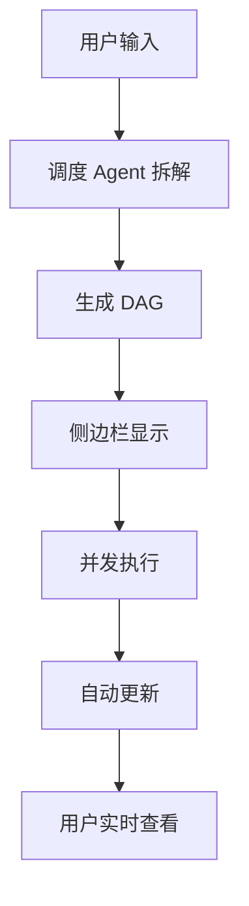
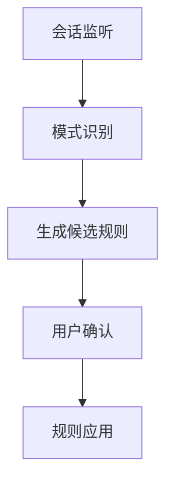
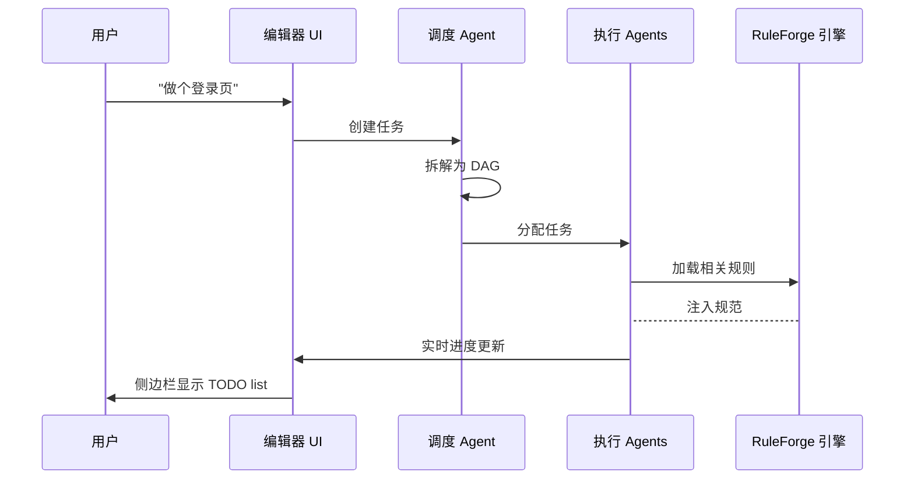

# 📘 NightShift PRD v2.1（完整整合版）

## 一、产品概述
### 1.1 核心定位
> **NightShift**：一个面向 Vibe Coding 的 AI 原生编辑器。你只负责描述需求与验收，它负责拆解任务、多 Agent 并发执行、自动注入规范、实时追踪进度。你睡觉时，它在写代码。

### 1.2 核心定位
- ✅ **多 Agent 并发**：同时跑前端/后端/测试任务，比单 Agent 快 3-5 倍
- ✅ **智能任务计划**：自动拆解需求 → 生成 TODO list → 实时追踪进度
- ✅ **RuleForge 规则引擎**：从开发会话中自动提炼最佳实践，越用越懂你
- ✅ **零代码基础**：你负责描述需求，AI 负责实现 + 测试 + 纠错
- ✅ **继承 CodePilot 能力**：多服务商支持、用量统计、聊天界面等

### 1.3 MVP 范围（4 周冲刺）
| 模块 | MVP 包含 | 暂缓至 V1.0 |
|------|----------|-------------|
| **核心调度** | 任务拆解 + DAG 依赖 + 进度追踪 | 复杂冲突仲裁 |
| **Agent 执行器** | 前端/后端/调度 3 角色 + Skill 库 | 测试/文档 Agent |
| **RuleForge 引擎** | 规则提取 + YAML 生成 + 自动注入 | 社区贡献/PR 自动创建 |
| **任务计划面板** | TODO list + 实时进度 + 自动勾选 | 甘特图/时间估算 |
| **通信协议** | Level1 结构化 JSON（0 token） | Level2/3 按需 LLM |
| **模型路由** | Ollama 本地 + OpenRouter 兜底 | 成本优化面板 |
| **编辑器基础** | 继承 CodePilot（聊天/代码补全/多服务商） | 移动端适配 |

---

## 二、核心功能设计
### 2.1 任务计划系统（新增核心功能）

**用户视角**：
- 输入需求 → 自动生成任务 DAG
- 侧边栏显示任务列表与进度
- 自动勾选已完成任务
- 生成 Git 提交信息

### 2.2 RuleForge 引擎（整合为核心模块）

**工作流**：
- 记录 AI 生成代码、用户修改、测试失败
- 检测重复问题模式，提取解决方案
- 生成候选规则，用户确认后自动注入
- 下次任务自动加载相关规则

### 2.3 多 Agent 通信协议
**三级通信架构（MVP 先做 Level1）**：
- **Level1**：JSON-RPC over WebSocket，结构化数据交换（0 token）
- **Level2**：语义摘要，低 token 消耗
- **Level3**：大模型介入，按需调用

### 2.4 模型路由策略
**智能路由（按任务类型分配）**：
- **简单任务**：Ollama 本地模型，0 token 优先
- **中等任务**：Ollama/qwen-coder:7b
- **复杂任务**：GLM-5 / Kimi-K2.5
- **降级策略**：本地失败 → OpenRouter 兜底

### 2.5 继承 CodePilot 功能
**必须保留的核心功能**：
- 聊天界面：侧边对话面板，支持多轮对话
- 代码补全：Inline completion + Chat 模式
- 多服务商支持：OpenAI/Anthropic/Ollama/DeepSeek 等
- 用量统计：Token 消耗、成本追踪
- 文件管理：项目树、快速切换
- 终端集成：内置终端执行命令

---

## 三、技术架构
### 3.1 项目结构（基于 CodePilot 改造）
```
NightShift/
├── src/                           # CodePilot 核心代码（保留）
├── packages/                      # NightShift 新增模块
│   ├── core/                      # 核心引擎
│   ├── ruleforge/                 # 规则引擎（核心模块）
│   ├── agents/                    # Agent 角色库
│   └── ui/                        # 新增 UI 组件
├── config/
├── .nightshift/                   # 运行时数据
├── package.json                   # 合并配置
└── README.md
```

### 3.2 核心数据流


### 3.3 与 CodePilot 集成点
| CodePilot 模块 | NightShift 改造方式 | 说明 |
|----------------|---------------------|------|
| `src/providers/chat-provider.ts` | 保留并扩展 | 添加任务计划入口 |
| `src/services/model-service.ts` | 保留 + 路由层 | 添加智能路由逻辑 |
| `src/utils/usage-tracker.ts` | 保留 | 增加 Agent 维度统计 |
| `src/extension.ts` | 合并入口 | 注册 NightShift 命令 |
| `package.json` | 合并配置 | 添加 NightShift 配置项 |

---

## 四、开发计划（4 周 MVP）
### 第 1 周：RuleForge 核心（你的原创）
- **目标**：能提取规则 + 生成 YAML + 本地保存
- **任务分解**：
  - D1: 会话日志解析器
  - D2: 模式识别引擎
  - D3: YAML 生成器
  - D4-5: 测试 + 文档
- **交付物**：`ruleforge extract` 命令能跑，输出符合 REP 的 YAML 文件

### 第 2 周：任务调度核心
- **目标**：任务拆解 + DAG 管理 + 进度追踪
- **任务分解**：
  - D1-2: 调度 Agent
  - D3: 任务管理器
  - D4-5: 进度面板（UI）
- **交付物**：输入需求 → 自动生成任务计划，侧边栏实时显示进度

### 第 3 周：Agent 执行器 + 通信
- **目标**：多 Agent 并发 + Level1 通信
- **任务分解**：
  - D1-2: Agent 角色实现
  - D3: Level1 通信协议
  - D4-5: 模型路由
- **交付物**：2 个 Agent 能并发执行任务，通信不走 LLM（0 token）

### 第 4 周：整合 + 打包
- **目标**：完整工作流 + 演示
- **任务分解**：
  - D1-2: 端到端联调
  - D3: Trae 插件封装//错误取消
  - D4-5: 文档 + 演示
- **交付物**：能跑通的 MVP，GitHub 开源发布

---

## 五、模型推荐（针对 Trae 开发）
### 5.1 RuleForge 开发（规则提取引擎）
- **首选**：DeepSeek-V3.1-Terminus
- **备选**：Qwen3.6-Plus
- **理由**：擅长代码分析和模式识别，输出结构化

### 5.2 NightShift 核心（调度/通信/UI）
- **首选**：GLM-5 或 Kimi-K2.5
- **备选**：MiniMax-M2.7
- **理由**：架构设计能力强，理解并发/异步逻辑

### 5.3 日常开发（增删改查）
- **首选**：Qwen3.6-Plus
- **理由**：速度快，适合日常编码

---

## 六、配置示例
### 6.1 `config/agents.yaml`
```yaml
agents:
  scheduler:
    role: "任务拆解专家"
    model: "glm-5"
    skills: ["prd_parser", "dag_generator"]
  
  frontend:
    role: "Vue3 开发专家"
    model: "ollama/qwen-coder:7b"
    fallback: "openrouter/deepseek-coder:free"
    skills: ["vue_component", "tailwind_styling"]
  
  backend:
    role: "FastAPI 开发专家"
    model: "ollama/qwen-coder:7b"
    skills: ["fastapi_crud", "jwt_auth"]

ruleforge:
  enabled: true
  auto_extract: true
  min_confidence: 0.8
  storage: ".nightshift/rules"
```

### 6.2 `config/models.yaml`
```yaml
routing:
  simple_tasks:
    models: ["ollama/qwen2.5:7b"]
    max_tokens: 2000
    
  code_generation:
    models: ["ollama/qwen-coder:7b", "deepseek-v3.1"]
    max_tokens: 8000
    
  architecture:
    models: ["glm-5", "kimi-k2.5"]
    max_tokens: 16000
    
  rule_extraction:
    models: ["deepseek-v3.1-terminus"]
    max_tokens: 12000

fallback:
  - "openrouter/free"
  - "ollama/local"
```

---

## 七、风险与应对
| 风险 | 影响 | 应对 |
|------|------|------|
| 多 Agent 冲突 | 代码风格不一致 | RuleForge 强制规范 + 0 号 Agent 审核 |
| Token 爆炸 | 成本失控 | Level1 通信（0 token）+ 本地优先 |
| 任务卡住 | 用户等太久 | 超时自动重试 + 降级到单 Agent |
| 规则污染 | 低质量规则 | 置信度阈值 + 用户确认 + 人工审核 |
| CodePilot 限制 | BUSL 许可证 | 仅限个人/学术使用，不商用 |

---
