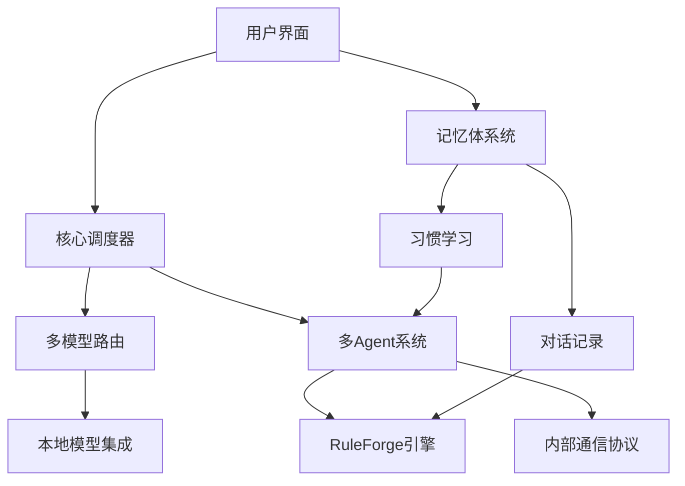
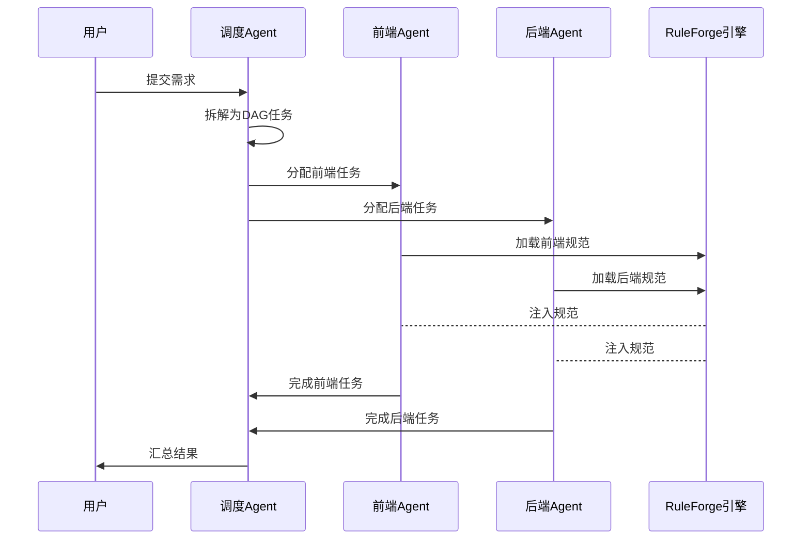
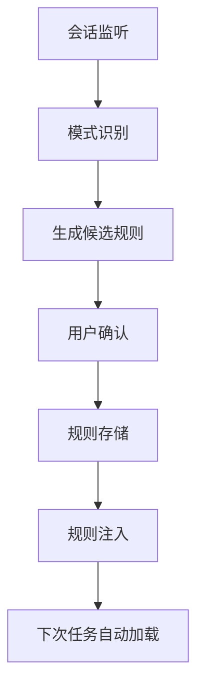
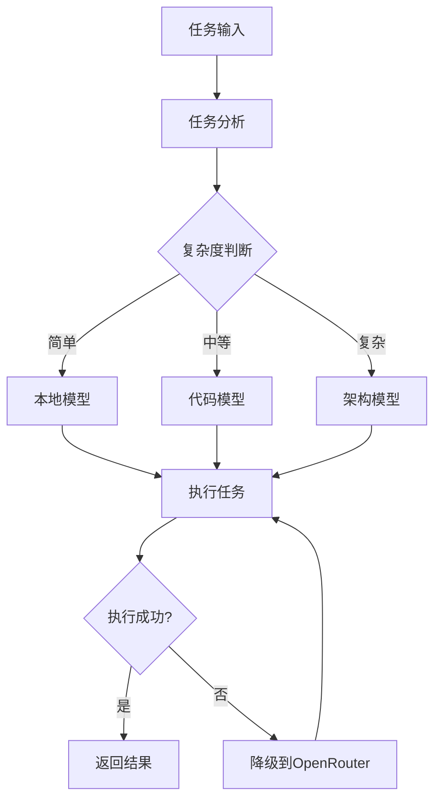
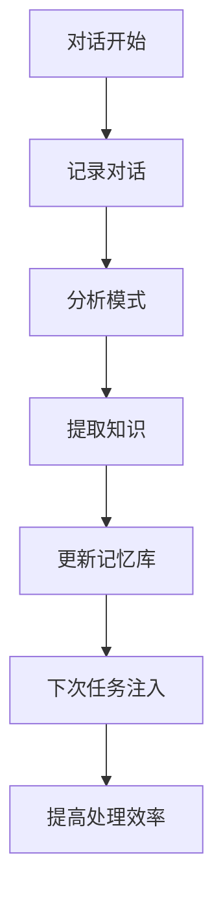

# 📘 NightShift PRD v3.0（独立应用重构版）

## 一、产品概述
### 1.1 核心定位
> **NightShift**：一个面向 Vibe Coding 的 AI 原生编程工具，独立桌面应用。你只负责描述需求与验收，它负责拆解任务、多 Agent 并发执行、自动注入规范、实时追踪进度。你睡觉时，它在写代码。

### 1.2 产品愿景
成为新一代 AI 原生编程工具，与 VSCode、Trae、Cursor 并列，但更轻量、更智能。通过多 Agent 并发模式，将开发效率提升 3-5 倍。

### 1.3 核心价值主张
- ✅ **多 Agent 并发**：同时跑前端/后端/测试任务，比单 Agent 快 3-5 倍
- ✅ **智能任务计划**：自动拆解需求 → 生成 TODO list → 实时追踪进度
- ✅ **RuleForge 规则引擎**：从开发会话中自动提炼最佳实践，越用越懂你
- ✅ **多模型智能路由**：根据任务类型自动选择最佳模型，优化成本
- ✅ **本地模型集成**：内置类似 Ollama 的功能，直接在软件中使用本地模型
- ✅ **改进的记忆体**：主 Agent 实时学习用户习惯，持续优化任务处理
- ✅ **独立桌面应用**：基于 Electron + Next.js，跨平台支持

### 1.4 目标用户
| 用户类型 | 需求 | 使用场景 |
|----------|------|----------|
| **个人开发者** | 快速实现想法，减少重复劳动 | 独立项目开发、原型验证 |
| **小型团队** | 协作开发，统一规范 | 小型产品开发、内部工具 |
| **编程学习者** | 通过 AI 辅助学习编程 | 学习项目、练习编码 |

### 1.5 MVP 范围（6 周冲刺）
| 模块 | MVP 包含 | 暂缓至 V1.0 |
|------|----------|-------------|
| **UI 重构** | 基于 NightShift 需求重新设计布局 | 复杂主题定制 |
| **核心调度** | 任务拆解 + DAG 依赖 + 进度追踪 | 复杂冲突仲裁 |
| **Agent 执行器** | 前端/后端/调度 3 角色 + Skill 库 | 测试/文档 Agent |
| **RuleForge 引擎** | 规则提取 + YAML 生成 + 自动注入 | 社区贡献/PR 自动创建 |
| **任务计划面板** | TODO list + 实时进度 + 自动勾选 | 甘特图/时间估算 |
| **通信协议** | Level1 结构化 JSON（0 token） | Level2/3 按需 LLM |
| **模型路由** | Ollama 本地 + OpenRouter 兜底 | 成本优化面板 |
| **本地模型集成** | 本地模型选择、转换、调度 | 高级参数调整 |
| **记忆体系统** | 对话记录、习惯学习、知识传递 | 高级学习算法 |

---

## 二、架构重构
### 2.1 架构原则
1. **独立应用**：NightShift 是独立软件，不是插件
2. **模块分离**：CodePilot 主体代码与新增核心模块分离，采用调用模式
3. **核心突出**：RuleForge、多 Agent 并发、多模型路由是核心模块
4. **UI 优先**：从 UI 调整开始，确保界面符合 NightShift 需求

### 2.2 新项目结构
```
NightShift/
├── src/                           # CodePilot 核心代码（保留，作为基础）
│   ├── providers/                 # 模型提供商
│   ├── services/                  # 核心服务
│   ├── utils/                     # 工具函数
│   └── types/                     # 类型定义
├── packages/                      # NightShift 新增模块（核心）
│   ├── core/                      # 核心引擎
│   │   ├── scheduler/             # 任务调度器
│   │   ├── agents/                # Agent 系统
│   │   └── communication/         # 内部通信协议
│   ├── ruleforge/                 # RuleForge 规则引擎（核心模块）
│   │   ├── extractor/             # 规则提取器
│   │   ├── storage/               # 规则存储
│   │   └── injector/              # 规则注入器
│   ├── router/                    # 多模型路由（核心模块）
│   │   ├── task-analyzer/         # 任务分析器
│   │   ├── model-selector/        # 模型选择器
│   │   └── fallback/              # 降级策略
│   ├── local-models/              # 本地模型集成
│   │   ├── ollama-wrapper/        # Ollama 封装
│   │   ├── model-converter/       # 模型转换器
│   │   └── model-manager/         # 模型管理器
│   ├── memory/                    # 记忆体系统
│   │   ├── conversation-logger/   # 对话记录器
│   │   ├── habit-learner/         # 习惯学习器
│   │   └── knowledge-transfer/    # 知识传递器
│   └── ui/                        # UI 组件（重新设计）
│       ├── layout/                # 布局组件
│       ├── panels/                # 面板组件
│       └── widgets/               # 小部件
├── electron/                      # Electron 主进程
├── config/                        # 配置文件
├── .nightshift/                   # 运行时数据
├── package.json                   # 合并配置
└── README.md
```

### 2.3 模块依赖关系


### 2.4 与 CodePilot 的集成方式
| CodePilot 模块 | NightShift 集成方式 | 说明 |
|----------------|---------------------|------|
| `src/providers/` | 保留并扩展 | 添加路由层，支持多模型调度 |
| `src/services/model-service.ts` | 保留 + 路由层 | 添加智能路由逻辑 |
| `src/utils/usage-tracker.ts` | 保留 | 增加 Agent 维度统计 |
| `src/extension.ts` | 合并入口 | 注册 NightShift 命令 |
| `package.json` | 合并配置 | 添加 NightShift 配置项 |

**重要**：CodePilot 主体代码作为基础层，NightShift 新增模块作为核心层，通过调用模式集成，方便未来重写 CodePilot 所有功能。

---

## 三、核心功能详细设计
### 3.1 多 Agent 并发系统
#### 3.1.1 Agent 角色定义
| 角色 | 职责 | 模型建议 | 技能 |
|------|------|----------|------|
| **调度 Agent** | 任务拆解、分配、监控 | 本地模型（Ollama） | prd_parser, dag_generator |
| **前端 Agent** | UI 组件、样式、交互 | qwen-coder:7b | vue_component, tailwind_styling |
| **后端 Agent** | API、数据库、逻辑 | qwen-coder:7b | fastapi_crud, jwt_auth |
| **测试 Agent** | 单元测试、集成测试 | deepseek-coder | pytest, test_generation |

#### 3.1.2 并发执行流程


### 3.2 RuleForge 规则引擎（核心模块）
#### 3.2.1 工作流程


#### 3.2.2 规则类型
| 规则类型 | 描述 | 示例 |
|----------|------|------|
| **代码风格** | 代码格式、命名规范 | "使用驼峰命名法" |
| **架构约束** | 设计模式、文件结构 | "使用组件化架构" |
| **最佳实践** | 常见问题解决方案 | "避免深层嵌套" |
| **错误模式** | 常见错误及修复 | "处理空指针异常" |

#### 3.2.3 规则 YAML 格式
```yaml
rule:
  id: "code-style-001"
  name: "驼峰命名法"
  description: "变量和函数使用驼峰命名法"
  pattern: "snake_case|kebab-case"
  replacement: "camelCase"
  confidence: 0.95
  source: "conversation-2024-04-24"
  tags: ["code-style", "naming"]
```

### 3.3 多模型智能路由
#### 3.3.1 路由策略
| 任务类型 | 模型选择 | 理由 |
|----------|----------|------|
| **简单任务** | Ollama 本地模型 | 0 token，快速响应 |
| **代码生成** | qwen-coder:7b | 代码能力强 |
| **架构设计** | GLM-5 / Kimi-K2.5 | 架构设计能力强 |
| **规则提取** | DeepSeek-V3.1-Terminus | 模式识别能力强 |
| **降级策略** | OpenRouter 兜底 | 确保服务可用 |

#### 3.3.2 路由决策流程


### 3.4 本地模型集成
#### 3.4.1 功能特点
1. **一键选择**：在设置界面直接选择本地模型文件
2. **自动转换**：自动进行格式转换，支持主流模型格式
3. **智能调度**：根据任务需求自动选择本地或云端模型
4. **内存优化**：按需加载，不长期占用内存

#### 3.4.2 支持的模型格式
| 格式 | 说明 | 转换工具 |
|------|------|----------|
| GGUF | 量化模型格式 | llama.cpp |
| GGML | 旧版量化格式 | llama.cpp |
| PyTorch | 原始模型格式 | transformers |
| SafeTensors | 安全张量格式 | transformers |

### 3.5 改进的记忆体系统
#### 3.5.1 功能模块
| 模块 | 功能 | 输出 |
|------|------|------|
| **对话记录器** | 记录用户指令和 AI 响应 | 结构化日志 |
| **习惯学习器** | 分析用户习惯和偏好 | 用户画像 |
| **知识传递器** | 将知识传递给下级 Agent | 上下文注入 |

#### 3.5.2 学习流程


### 3.6 内部通信协议
#### 3.6.1 三级通信架构
| 级别 | 协议 | Token 消耗 | 适用场景 |
|------|------|------------|----------|
| **Level1** | JSON-RPC over WebSocket | 0 token | 结构化数据交换 |
| **Level2** | 语义摘要 | 低 token | 简单语义传递 |
| **Level3** | 大模型介入 | 高 token | 复杂语义理解 |

#### 3.6.2 Level1 协议示例
```json
{
  "jsonrpc": "2.0",
  "method": "task.assign",
  "params": {
    "task_id": "task-001",
    "agent": "frontend",
    "description": "创建登录页面组件",
    "requirements": ["Vue3", "Tailwind CSS"],
    "deadline": "2024-04-24T18:00:00"
  },
  "id": 1
}
```

---

## 四、UI 重新设计
### 4.1 设计原则
1. **功能优先**：界面布局服务于核心功能
2. **多 Agent 可视化**：清晰显示多个 Agent 的状态
3. **任务计划突出**：任务列表和进度是核心界面元素
4. **规则可视化**：RuleForge 规则易于查看和管理

### 4.2 新布局结构
```
┌─────────────────────────────────────────────────────────────┐
│                        顶部工具栏                           │
├────────────┬────────────────────────────────────────────────┤
│            │                                                │
│   侧边栏    │                    主内容区域                   │
│  (Sidebar)  │              (Main Content Area)               │
│            │                                                │
│  - 项目列表  │  ┌──────────────────────────────────────────┐ │
│  - 任务计划  │  │                                          │ │
│  - Agent面板 │  │              聊天/代码编辑区域             │ │
│  - 规则库   │  │                                          │ │
│  - 设置     │  │                                          │ │
│            │  └──────────────────────────────────────────┘ │
│            │                                                │
│            │  ┌──────────────────────────────────────────┐ │
│            │  │              Agent 状态面板               │ │
│            │  │  调度Agent: 运行中 | 前端Agent: 空闲      │ │
│            │  │  后端Agent: 运行中 | 测试Agent: 等待      │ │
│            │  └──────────────────────────────────────────┘ │
├────────────┴────────────────────────────────────────────────┤
│                        底部状态栏                           │
└─────────────────────────────────────────────────────────────┘
```

### 4.3 核心界面组件
#### 4.3.1 任务计划面板
- **位置**：侧边栏顶部
- **功能**：显示任务 DAG、进度、状态
- **交互**：点击任务查看详情，拖拽调整优先级

#### 4.3.2 Agent 状态面板
- **位置**：主内容区域底部
- **功能**：显示所有 Agent 的实时状态
- **交互**：点击查看 Agent 详情，强制停止任务

#### 4.3.3 规则库面板
- **位置**：侧边栏中部
- **功能**：显示所有 RuleForge 规则
- **交互**：启用/禁用规则，编辑规则内容

#### 4.3.4 模型路由面板
- **位置**：设置界面
- **功能**：配置模型路由策略
- **交互**：设置任务类型与模型的映射关系

---

## 五、开发计划（6 周 MVP）
### 第 1 周：UI 重新设计
- **目标**：完成 NightShift 专属 UI 设计
- **任务分解**：
  - D1-2: 设计系统建立（色彩、字体、间距）
  - D3-4: 核心布局组件开发
  - D5: 任务计划面板开发
  - D6-7: Agent 状态面板开发
- **交付物**：可运行的 UI 框架，包含任务计划和 Agent 状态显示

### 第 2 周：RuleForge 核心
- **目标**：能提取规则 + 生成 YAML + 本地保存
- **任务分解**：
  - D1: 会话日志解析器
  - D2: 模式识别引擎
  - D3: YAML 生成器
  - D4-5: 规则存储和加载
  - D6-7: 测试 + 文档
- **交付物**：RuleForge 引擎能提取规则并生成 YAML 文件

### 第 3 周：任务调度核心
- **目标**：任务拆解 + DAG 管理 + 进度追踪
- **任务分解**：
  - D1-2: 调度 Agent 开发
  - D3: 任务管理器
  - D4-5: DAG 可视化
  - D6-7: 进度追踪系统
- **交付物**：输入需求 → 自动生成任务计划，UI 实时显示进度

### 第 4 周：多模型路由
- **目标**：智能路由 + 本地模型集成
- **任务分解**：
  - D1-2: 任务分析器
  - D3: 模型选择器
  - D4-5: 本地模型封装
  - D6-7: 降级策略
- **交付物**：多模型路由系统，支持本地和云端模型

### 第 5 周：多 Agent 并发
- **目标**：多 Agent 并发 + Level1 通信
- **任务分解**：
  - D1-2: Agent 角色实现
  - D3: Level1 通信协议
  - D4-5: 并发执行引擎
  - D6-7: 结果汇总
- **交付物**：3 个 Agent 能并发执行任务，通信不走 LLM（0 token）

### 第 6 周：整合 + 记忆体
- **目标**：完整工作流 + 记忆体系统
- **任务分解**：
  - D1-2: 端到端联调
  - D3-4: 记忆体系统开发
  - D5-6: 文档 + 演示
  - D7: 打包发布
- **交付物**：能跑通的 MVP，GitHub 开源发布

---

## 六、技术栈确认
### 6.1 前端技术栈
| 技术 | 版本 | 用途 |
|------|------|------|
| **Electron** | latest | 桌面应用容器 |
| **Next.js** | 14.2.35 | React 框架 |
| **React** | 18.2.0 | UI 库 |
| **TypeScript** | 5.x | 类型系统 |
| **Tailwind CSS** | 3.4.1 | 样式系统 |
| **Radix UI** | latest | 无头组件库 |
| **Lucide React** | latest | 图标库 |

### 6.2 后端技术栈
| 技术 | 用途 |
|------|------|
| **Node.js** | 运行时环境 |
| **WebSocket** | 实时通信 |
| **SQLite** | 本地数据存储 |
| **Ollama** | 本地模型运行时 |

### 6.3 开发工具
| 工具 | 用途 |
|------|------|
| **Vite** | 构建工具 |
| **ESLint** | 代码检查 |
| **Prettier** | 代码格式化 |
| **Jest** | 单元测试 |
| **Playwright** | E2E 测试 |

---

## 七、风险与应对
| 风险 | 影响 | 应对 |
|------|------|------|
| **多 Agent 冲突** | 代码风格不一致 | RuleForge 强制规范 + 调度 Agent 审核 |
| **Token 爆炸** | 成本失控 | Level1 通信（0 token）+ 本地优先 |
| **任务卡住** | 用户等太久 | 超时自动重试 + 降级到单 Agent |
| **规则污染** | 低质量规则 | 置信度阈值 + 用户确认 + 人工审核 |
| **本地模型性能** | 响应慢 | 智能路由，复杂任务用云端模型 |
| **跨平台兼容** | 部分功能不可用 | 渐进增强，核心功能全平台支持 |

---

## 八、成功指标
### 8.1 技术指标
| 指标 | 目标 | 测量方法 |
|------|------|----------|
| **多 Agent 并发效率** | 比单 Agent 快 3 倍 | 任务完成时间对比 |
| **RuleForge 规则准确率** | ≥ 85% | 规则应用成功率 |
| **模型路由准确率** | ≥ 90% | 任务匹配正确率 |
| **本地模型响应时间** | ≤ 5 秒 | 平均响应时间 |
| **系统稳定性** | 崩溃率 ≤ 1% | 崩溃次数/总运行时间 |

### 8.2 用户指标
| 指标 | 目标 | 测量方法 |
|------|------|----------|
| **用户满意度** | NPS ≥ 30 | 用户调研 |
| **任务完成率** | ≥ 80% | 任务成功完成比例 |
| **用户留存率** | 7 日留存 ≥ 40% | 用户回访数据 |
| **社区贡献** | ≥ 10 个外部贡献者 | GitHub 贡献者数量 |

---

## 九、下一步行动
### 9.1 立即行动（本周）
1. **UI 设计评审**：基于本文档重新设计 UI 布局
2. **技术栈确认**：确认 Electron + Next.js 配置
3. **开发环境搭建**：设置开发环境和构建流程

### 9.2 短期行动（1-2 周）
1. **RuleForge 原型**：开发规则提取原型
2. **调度 Agent 原型**：开发任务拆解原型
3. **通信协议设计**：设计 Level1 通信协议

### 9.3 中期行动（3-4 周）
1. **多模型路由**：实现智能路由系统
2. **本地模型集成**：集成 Ollama 功能
3. **记忆体系统**：开发基础记忆体功能

### 9.4 长期行动（5-6 周）
1. **多 Agent 并发**：实现并发执行引擎
2. **端到端测试**：完整工作流测试
3. **文档和演示**：编写文档，准备演示

---

## 十、附录
### 10.1 术语表
| 术语 | 定义 |
|------|------|
| **Vibe Coding** | AI 辅助编程，用户描述需求，AI 实现代码 |
| **多 Agent 并发** | 多个 AI Agent 同时执行不同任务 |
| **RuleForge** | 从开发会话中自动提取规则的引擎 |
| **DAG** | 有向无环图，表示任务依赖关系 |
| **Level1 通信** | 结构化 JSON 通信，0 token 消耗 |

### 10.2 参考资料
1. CodePilot 源码分析
2. 多 Agent 系统设计模式
3. 规则引擎架构设计
4. 模型路由策略研究
5. 本地模型集成方案

### 10.3 变更记录
| 版本 | 日期 | 变更内容 |
|------|------|----------|
| v3.0 | 2024-04-24 | 重构为独立应用，调整架构和功能 |

---

**文档结束** · NightShift v3.0 · 独立应用重构版