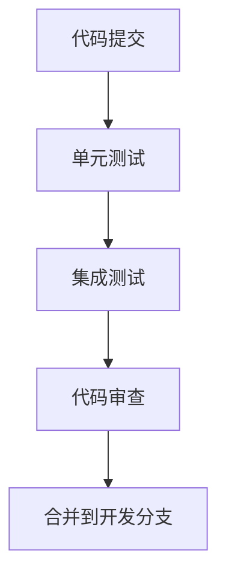
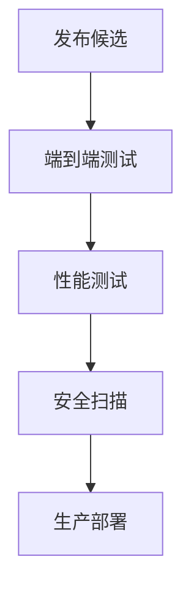

# NightShift 集成系统测试策略

## 🎯 测试目标

确保 NightShift 集成系统的所有组件能够协同工作，提供稳定、高效的智能助手服务。

## 📋 测试范围

### 核心组件测试
- [ ] **记忆体系统** (Memory System)
  - ConversationLogger 对话日志记录
  - HabitLearner 习惯学习
  - KnowledgeTransfer 知识传递
  - MemoryStore 记忆存储

- [ ] **任务调度系统** (Scheduler System)
  - TaskDecomposer 任务分解
  - TaskManager 任务管理
  - WebSocket 实时通信

- [ ] **RuleForge 规则引擎** (RuleForge Engine)
  - 规则模式识别
  - YAML 规则生成
  - 规则注入功能

- [ ] **集成服务** (Integration Service)
  - 组件初始化
  - 消息处理管道
  - 错误处理机制

### 集成测试
- [ ] **组件间通信**
- [ ] **数据流验证**
- [ ] **状态管理**
- [ ] **错误恢复**

### 端到端测试
- [ ] **完整用户流程**
- [ ] **UI 交互测试**
- [ ] **性能基准测试**

## 🧪 测试类型

### 1. 单元测试 (Unit Testing)
**目标**: 验证单个组件的功能正确性
**工具**: Jest + Testing Library
**覆盖率目标**: > 80%

### 2. 集成测试 (Integration Testing)
**目标**: 验证组件间的协同工作
**工具**: Jest + Supertest
**重点**: API 接口、数据流

### 3. 端到端测试 (E2E Testing)
**目标**: 验证完整用户流程
**工具**: Playwright
**场景**: 真实用户交互流程

### 4. 性能测试 (Performance Testing)
**目标**: 验证系统性能和可扩展性
**工具**: Artillery + Lighthouse
**指标**: 响应时间、内存使用、吞吐量

## 📊 测试指标

### 质量指标
- **代码覆盖率**: > 80%
- **测试通过率**: 100%
- **缺陷密度**: < 0.1 defects/kloc

### 性能指标
- **响应时间**: < 500ms (平均)
- **内存使用**: < 500MB (峰值)
- **并发用户**: > 50 用户
- **吞吐量**: > 100 请求/秒

## 🚀 测试执行流程

### 阶段 1: 单元测试执行
```bash
# 运行所有单元测试
npm run test:unit

# 运行特定组件测试
npm run test:unit -- --testPathPattern=memory
npm run test:unit -- --testPathPattern=scheduler
npm run test:unit -- --testPathPattern=ruleforge
```

### 阶段 2: 集成测试执行
```bash
# 运行集成测试
npm run test:integration

# 运行 API 测试
npm run test:api
```

### 阶段 3: 端到端测试执行
```bash
# 运行 E2E 测试
npm run test:e2e

# 运行 UI 测试
npm run test:ui
```

### 阶段 4: 性能测试执行
```bash
# 运行性能测试
npm run test:performance

# 生成性能报告
npm run test:performance:report
```

## 📝 测试用例设计

### 记忆体系统测试用例
```typescript
// 测试用例示例
describe('Memory System', () => {
  test('对话日志记录', async () => {
    // 验证消息记录功能
  });
  
  test('习惯学习分析', async () => {
    // 验证用户偏好识别
  });
  
  test('知识提取和传递', async () => {
    // 验证知识管理功能
  });
});
```

### 任务调度系统测试用例
```typescript
describe('Scheduler System', () => {
  test('任务分解功能', async () => {
    // 验证复杂任务分解
  });
  
  test('任务调度执行', async () => {
    // 验证任务执行流程
  });
  
  test('实时状态更新', async () => {
    // 验证 WebSocket 通信
  });
});
```

### 集成服务测试用例
```typescript
describe('Integration Service', () => {
  test('服务初始化', async () => {
    // 验证组件加载
  });
  
  test('消息处理管道', async () => {
    // 验证完整消息流程
  });
  
  test('错误处理机制', async () => {
    // 验证异常情况处理
  });
});
```

## 🔧 测试环境配置

### 开发环境
- **Node.js**: v18+
- **数据库**: SQLite (测试用)
- **缓存**: Redis (可选)

### 测试环境
- **CI/CD**: GitHub Actions
- **数据库**: PostgreSQL
- **监控**: Prometheus + Grafana

### 生产环境模拟
- **负载均衡**: Nginx
- **数据库**: PostgreSQL 集群
- **缓存**: Redis 集群

## 📈 测试报告

### 自动生成报告
- **单元测试报告**: Jest HTML Reporter
- **覆盖率报告**: Istanbul/LCOV
- **性能报告**: Lighthouse CI
- **E2E 报告**: Playwright Reporter

### 手动测试报告
- **测试用例执行记录**
- **缺陷跟踪报告**
- **性能基准对比**

## 🛠️ 测试工具链

### 测试框架
- **Jest**: 单元测试和集成测试
- **Playwright**: 端到端测试
- **Testing Library**: React 组件测试

### 性能工具
- **Artillery**: 负载测试
- **Lighthouse**: 性能审计
- **Web Vitals**: 核心性能指标

### 监控工具
- **Prometheus**: 指标收集
- **Grafana**: 数据可视化
- **Sentry**: 错误监控

## 🔄 持续测试流程

### 开发阶段


### 发布阶段


## 🚨 风险缓解策略

### 技术风险
- **数据库连接失败**: 实现重试机制
- **第三方服务不可用**: 添加降级策略
- **内存泄漏**: 定期内存分析

### 业务风险
- **数据丢失**: 定期备份和恢复测试
- **性能下降**: 性能监控和预警
- **安全漏洞**: 定期安全审计

## 📋 验收标准

### 功能验收
- [ ] 所有测试用例通过
- [ ] 代码覆盖率达标
- [ ] 性能指标满足要求
- [ ] 用户体验良好

### 质量验收
- [ ] 无严重缺陷
- [ ] 文档完整
- [ ] 部署流程顺畅
- [ ] 监控系统就绪

## 🔍 测试数据管理

### 测试数据策略
- **隔离环境**: 每个测试使用独立数据
- **数据工厂**: 自动生成测试数据
- **数据清理**: 测试后自动清理

### 敏感数据处理
- **脱敏处理**: 生产数据脱敏后使用
- **加密存储**: 敏感信息加密存储
- **访问控制**: 严格的权限管理

这个测试策略文档为 NightShift 集成系统提供了完整的测试指导，确保系统质量达到生产标准。